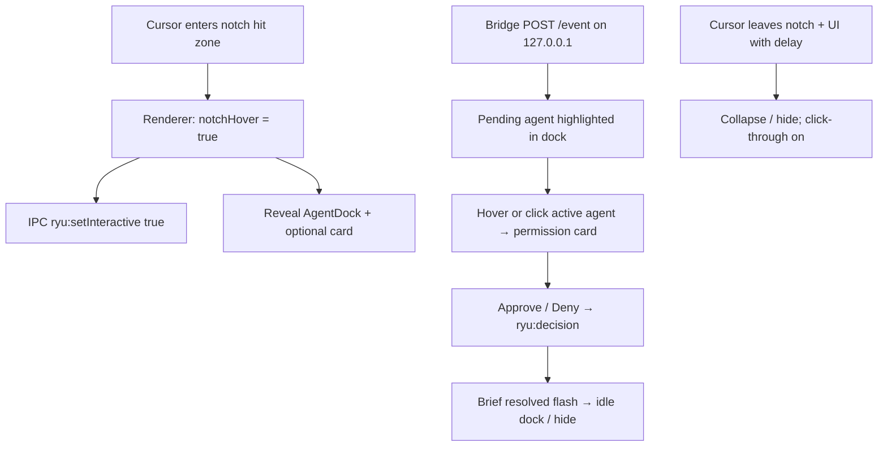

# Mac Notch Full Vision

## Intent

Ship the Mac product as if Apple built it: UI hangs from the **hardware notch**, **cursor entering the notch region** reveals the glass island, and the visual language matches your mockup (glowing notch anchor → multi-agent pill → dashed connector → permission card). This **goes beyond Track B**; Windows keeps [`electron/window.ts`](electron/window.ts), Mac gets a separate factory, and island redesign requires an explicit teammate sync.

**Visual source of truth:** uploaded mockup + existing permission-card copy from [`docs/parallel-work-split.md`](docs/parallel-work-split.md) §6.2 (title, Waiting badge, Deny/Approve, Local mode footer).

**Non-goals for this pass:** Unix socket bridge, mobile/push, real Cursor Multitask APIs, shipping the multi-agent dock on Windows (Mac-first; Windows can keep current single-pill until synced).

---

## Architecture



| Layer | Responsibility |
| --- | --- |
| [`electron/window.mac.ts`](electron/window.mac.ts) (new) | Full-display transparent overlay covering menubar/notch; always-on-top; Spaces/fullscreen; click-through |
| [`electron/main.ts`](electron/main.ts) | `darwin` → Mac factory; keep bridge + IPC |
| [`src/island/*`](src/island) | Redesign to mockup: notch anchor, AgentDock, connector, card |
| [`shared/types.ts`](shared/types.ts) | Minimal additive extensions only after teammate sync |
| Bridge / hook | Unchanged contract; still `127.0.0.1` |

---

## Phase 0 — Teammate sync (gate before coding UI)

Before rewriting island files, align with Track A owner:

- Branch: `them/mac-shell` (or agreed name); do **not** rewrite [`electron/window.ts`](electron/window.ts).
- Agree that Mac owns the **mockup dock UI** on darwin; Windows may keep current pill until a follow-up merge.
- Freeze rule: any change to [`shared/types.ts`](shared/types.ts) is additive (no breaking `RyuEvent` / `RyuDecision` fields the hook uses).
- Share this plan + mockup image so Windows UX doesn’t fight the new dock.

---

## Phase 1 — Mac window shell

**Add** [`electron/window.mac.ts`](electron/window.mac.ts) exporting the same surface as Windows: `createNotchWindow`, `setWindowInteractive`, `repositionNotchWindow`.

**Critical Mac difference vs current [`electron/window.ts`](electron/window.ts):** use primary display **`bounds`** (full screen including menubar/notch), not `workArea`. Today’s workArea-sized window cannot receive mouse events in the notch strip — hover-into-notch is impossible without this.

Mac window options (concrete):

- `frame: false`, `transparent: true`, `hasShadow: false`, `backgroundColor: '#00000000'`
- `alwaysOnTop: true` + `setAlwaysOnTop(true, 'screen-saver')`
- `setVisibleOnAllWorkspaces(true, { visibleOnFullScreen: true })`
- `skipTaskbar: true`, non-resizable/movable
- Default `setIgnoreMouseEvents(true, { forward: true })`
- `showInactive()` so focus doesn’t steal from the IDE
- Optional: `setWindowButtonVisibility(false)` if any chrome leaks

**Wire** in [`electron/main.ts`](electron/main.ts):

```ts
const windowApi =
  process.platform === 'darwin'
    ? await import('./window.mac')
    : await import('./window')
const win = windowApi.createNotchWindow()
// setInteractive / reposition from same module
```

Keep bridge start on `127.0.0.1:41999` unchanged. No Unix socket.

**Document quirks** in a short `docs/mac-shell-notes.md`: Spaces, fullscreen, Mission Control, click-through, multi-monitor (primary-only v1).

---

## Phase 2 — Notch hover interaction

### Hit model

In the renderer (Mac only), add a top-center **notch hit zone**:

- Horizontally centered, ~width of hardware notch (~180–220px on 14"/16"; fall back to ~200px centered on non-notch Macs).
- Vertically from `y = 0` down through menubar into a small “under-notch” band (~0–36px) so moving the cursor into the camera notch area triggers reveal.
- Zone uses `pointerEvents: 'auto'` while the rest of the overlay stays `none` until revealed UI is up.

Detect Mac in renderer via a tiny preload flag, e.g. `ryu.platform === 'darwin'` (add to [`electron/preload.ts`](electron/preload.ts) + [`src/env.d.ts`](src/env.d.ts)) — do not sniff UA alone.

### Reveal / hide rules

| Condition | UI |
| --- | --- |
| Idle + not hovering notch/UI | Hidden or minimal notch glow only (see Phase 3) |
| Hover enters notch zone | Spring-reveal **AgentDock** under notch |
| Pending permission (Attention) | Dock stays relevant; active agent ring + yellow/red status; hover or click active agent opens card |
| Expanded | Dock + dashed connector + permission card (mockup) |
| Leave notch+UI (150–250ms grace) | Collapse; if no pending event, hide dock; restore click-through |
| Pending + not hovering | Keep a **subtle** attention cue at notch (glow dot / tiny pill) so permissions aren’t toast-dismissible — matches product “persistent until resolved” |

Wire hover → existing `window.ryu.setInteractive` so click-through only disables while over notch zone / dock / card.

### Non-notch Macs

Same hover strip at top-center of `bounds` (no hardware notch). Dock still top-center; no fake notch cutout.

---

## Phase 3 — Island redesign to mockup

**Ownership:** Mac track rewrites island presentation. Prefer structure that keeps Windows compilable:

- Platform shell wrapper: e.g. `src/island/Island.tsx` picks `IslandMac` vs current layout when `ryu.platform === 'darwin'`, **or** always ship the new dock if teammate agrees (preferred for one UI).
- **Default decision for this plan:** one mockup-aligned UI for both platforms; Mac shell provides notch positioning/hover. Sync with teammate before merge.

### New / changed pieces

| Piece | Action |
| --- | --- |
| `src/island/NotchAnchor.tsx` | Glowing white dot under notch + optional short dashed stem into dock |
| `src/island/AgentDock.tsx` | Horizontal glass pill with agent slots + trailing `+` |
| `src/island/Island.tsx` | Compose: Anchor → Dock → connector → card; Framer Motion springs |
| `src/island/Expanded.tsx` | Keep card content; tighten spacing/typography to mockup; add optional “Details” chevron row (collapsed stub OK for v1) |
| `src/island/Idle.tsx` / `Attention.tsx` | Fold into dock states (idle = quiet dock or hidden; attention = ring + status dots) |
| `src/theme.ts` + `glass.ts` | Apple tokens: SF system fonts (already), accents `#F5C542` / `#34C759` / `#FF453A`; on darwin allow slightly more translucent glass + `backdrop-filter` experiment; Windows keep near-opaque glass |
| `src/state/useIsland.ts` | Add `notchHover` / `dockVisible` if needed; keep Idle→Attention→Expanded→Resolved; selecting a dock agent with a pending event expands |
| `src/demo/harness.tsx` | Inject multi-agent fake events to light different dock slots |

### Dock slots (mockup)

v1 dock is **presentational + demo-selectable**, backed by real `RyuEvent` when one arrives:

1. Placeholder / secondary agents (cube, sparkle, terminal, sailboat) — demo status dots only until real agents exist  
2. **Claude / Codex / Cursor** — map to existing `RyuAgent` + assets in [`src/assets/agents/`](src/assets/agents)  
3. Trailing **`+`** — non-functional or “coming soon” (no new agent install flow)

Active pending agent: white selection ring + status dot (yellow waiting / red destructive). Inactive slots: muted icons + grey/green/yellow dots per mockup for demo richness.

### Types (additive, sync required)

Extend only if needed, e.g.:

```ts
// optional — only if demo slots need ids beyond RyuAgent
export type DockSlotId = RyuAgent | 'cube' | 'sparkle' | 'terminal' | 'sailboat'
```

Do **not** change `RyuDecision` or hook `permissionDecision` shape. Real events remain `claude | codex | cursor`.

---

## Phase 4 — Apple motion and polish

- Framer Motion: dock scale/opacity spring from notch; card `y` + fade; ring pulse only while waiting  
- No purple gradients, no floating badges under the notch, no double-outline shadows (locked §6 bans still apply)  
- Approve = solid white; Deny = ghost border  
- Card ~380px; SF Pro / SF Mono via system stacks  
- Reduced-motion: respect `prefers-reduced-motion` (short fades, no pulse)

---

## Phase 5 — Verify and handoff artifacts

1. `npm install && npm run dev` on Mac  
2. Screenshots: Idle (hidden/minimal), Attention (dock + ring), Expanded (full mockup stack) → `docs/demo-shots/mac-*.png`  
3. Demo harness injects Claude permission; Approve/Deny still hits bridge  
4. Once Track A bridge is stable: `npm run hook:install` + live Claude Bash permission; confirm fail-open if RYU quit  
5. Update [`docs/README.md`](docs/README.md) + short note in parallel-work-split that Mac UI now follows mockup dock (supersedes single-pill on darwin)

---

## File touch map

| File | Change |
| --- | --- |
| `electron/window.mac.ts` | **Create** — bounds overlay, Mac always-on-top / Spaces |
| `electron/main.ts` | Darwin branch to Mac factory |
| `electron/preload.ts` + `src/env.d.ts` | Expose `platform` |
| `src/island/NotchAnchor.tsx`, `AgentDock.tsx` | **Create** |
| `src/island/Island.tsx`, `Expanded.tsx`, `Idle/Attention/Resolved` | Redesign to mockup |
| `src/theme.ts`, `src/island/glass.ts` | Apple/Mac glass tokens |
| `src/state/useIsland.ts`, `src/App.tsx` | Hover + dock visibility |
| `shared/types.ts` | Additive only after sync |
| `docs/mac-shell-notes.md`, demo-shots | Quirks + screenshots |

---

## Definition of done

- Cursor into notch (or top-center on non-notch) reveals the glass multi-agent dock; leave collapses with grace delay  
- Expanded state matches mockup layout: notch glow → dock → dashed line → permission card with Deny/Approve  
- Bridge remains `127.0.0.1`; Approve/Deny still resolve pending events  
- Windows `window.ts` untouched; Mac path isolated  
- Teammate synced on island + any types diff  
- Mac screenshots of Idle / Attention / Expanded attached
