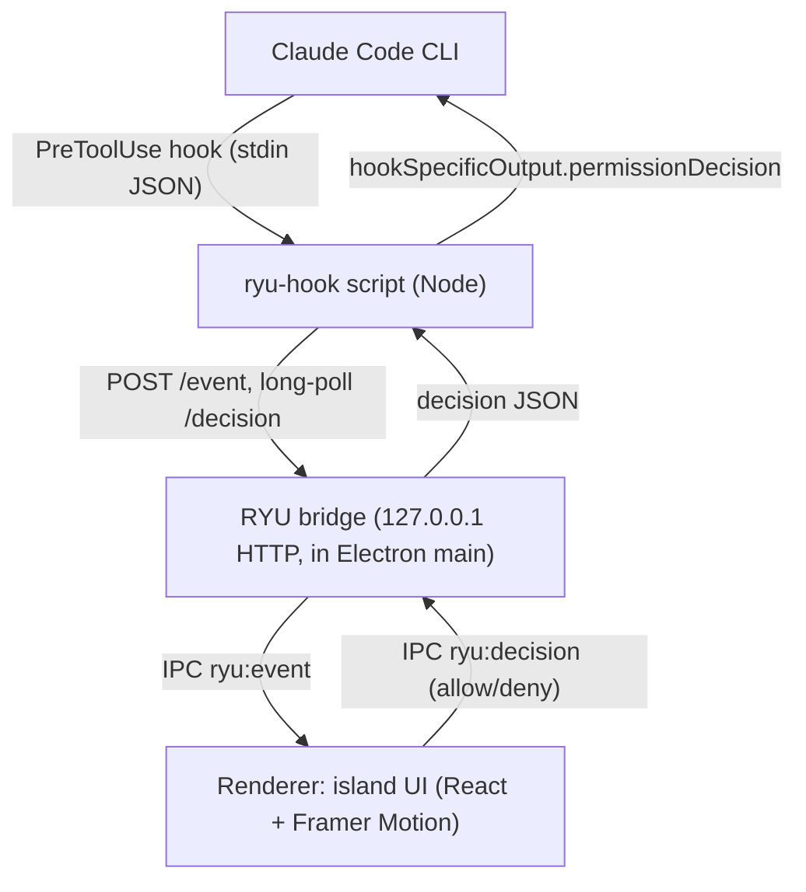

# RYU — Technical Execution Plan

**Date:** 2026-07-19 (updated 2026-07-20)  
**Status:** Phase 0 UI implemented and locked as visual reference; Phase 1 wiring exists — verify per OS.

Locked decisions: **Electron + React + TypeScript + Vite + Framer Motion**; first real agent = **Claude Code**; **permissions only** in v1 (questions logged for Phase 3); **Windows floating island + Mac notch shell** (parallel tracks); **demo (Phase 0) before function (Phase 1)**.

**UI source of truth (do not redesign before implementing ahead):** [parallel-work-split.md §6](./parallel-work-split.md) — glassmorphic pill + permission card. Live code: `src/island/*`, `src/theme.ts`. Screenshots: `docs/demo-shots/`.

**Team split (Windows vs Mac):** [parallel-work-split.md](./parallel-work-split.md)

Product intent: [product-and-feature-loops.md](./product-and-feature-loops.md) · [overview.md](./overview.md)

---

## Execution todos

1. **log-plan** — Write this doc into the repo and link from `docs/README.md` (done when this file exists).
2. **scaffold** — Scaffold `electron-vite` React+TS project in RYU with Framer Motion; base scripts (`dev`/`build`).
3. **window** — Implement `electron/window.ts`: transparent frameless always-on-top top-center notch window with click-through toggle via IPC.
4. **state-ui** — Build island state machine + Idle/Attention/Expanded/Resolved components with Framer Motion morph and glow ring per Apple Dynamic Island reference.
5. **harness** — Add dev-only demo harness that emits `RyuEvent` fakes + scripted ~90s timeline (Phase 0 exit criteria).
6. **bridge** — Phase 1: implement `127.0.0.1` bridge server (`POST /event` long-poll, resolve on decision, fail-open timeout) wired to renderer via IPC.
7. **hook** — Phase 1: implement Claude Code PreToolUse hook (`hooks/ryu-hook.mjs`) with wrapped `hookSpecificOutput` output + fail-open, and installer script.
8. **verify-p1** — Phase 1 verification: real Claude Bash permission → notch Allow/Deny drives CLI; kill RYU to confirm fallback.

---

## 1. Architecture



Core loop (unchanged across phases): **Idle → Attention → Understand → Decide → Resume**.

**Fail-open rule:** if the bridge is down, times out, or errors, the hook emits no decision (or `ask`) so Claude falls back to its normal terminal prompt. Never silent auto-allow.

---

## 2. Repository layout (fresh, under RYU repo)

- `package.json` — scripts: `dev`, `build`, `hook:install`
- `electron/main.ts` — app bootstrap, notch window, bridge server, IPC
- `electron/bridge.ts` — local HTTP server (127.0.0.1 only) + pending-decision map
- `electron/preload.ts` — contextBridge exposing safe IPC to renderer
- `electron/window.ts` — transparent frameless always-on-top window + click-through
- `src/` — React app (renderer)
  - `src/App.tsx` — state machine host
  - `src/island/Idle.tsx`, `Attention.tsx`, `Expanded.tsx`, `Resolved.tsx`
  - `src/island/Island.tsx` — Framer Motion `layout` morph container
  - `src/state/useIsland.ts` — reducer (idle/attention/expanded/resolved + queue)
  - `src/demo/harness.tsx` — Phase 0 fake-event buttons/timeline (dev-only)
  - `src/theme.ts` — dark pill, glow ring tokens
- `hooks/ryu-hook.mjs` — Claude Code PreToolUse hook (Phase 1)
- `scripts/install-claude-hook.mjs` — writes hook into Claude settings (Phase 1)
- `vite.config.ts`, `tsconfig.json`, `electron.vite.config.ts` (use `electron-vite`)
- `README.md` — run + demo script

Recommended scaffold: `electron-vite` (React + TS template) for fast HMR of both main and renderer.

---

## 3. Shared event contract (used by Phase 0 fakes and Phase 1 real)

```ts
type RyuAgent = "claude" | "codex" | "cursor";
interface RyuEvent {
  id: string;            // uuid; correlates decision
  agent: RyuAgent;       // drives which icon shows
  sessionLabel: string;  // e.g. "claude · ryu-api"
  tool: string;          // e.g. "Bash", "Write"
  preview: string;       // truncated command/path, safe length (~140 chars)
  risk?: "normal" | "destructive"; // Phase 4; compute later
  ts: number;
}
interface RyuDecision { id: string; decision: "allow" | "deny"; reason?: string; }
```

Phase 0 emits `RyuEvent` from the harness; Phase 1 emits the identical shape from the hook. The UI never knows the difference (this is what lets Phase 0 lock the feel).

---

## 4. Phase 0 — UX demo (no agent)

Goal: lock the Apple Dynamic Island feel of Idle → Attention → Expanded → Resolved with fake events.

**Window (`electron/window.ts`):**

- `new BrowserWindow({ transparent: true, frame: false, alwaysOnTop: true, skipTaskbar: true, resizable: false, hasShadow: false, type: 'toolbar' })`
- `setAlwaysOnTop(true, 'screen-saver')`; position top-center of `screen.getPrimaryDisplay().workArea`.
- Click-through: default `setIgnoreMouseEvents(true, { forward: true })`; renderer sends `ryu:setInteractive true/false` on pill `mouseenter/mouseleave` so only the pill is clickable, desktop stays usable.

**UI states** (Framer Motion `layout` + `AnimatePresence` on a single morphing container):

- **Idle:** thin dark capsule, low opacity, no glow.
- **Attention (hero):** centered circular agent icon + soft pulsing glow ring (AirDrop / Live-Activity energy, breathing animation), minimal/no text.
- **Expanded:** island morphs wider; shows icon + `sessionLabel` + "Permission required" + monospace `preview` + `Allow` / `Deny`.
- **Resolved:** brief allow/deny flash, then collapse to Idle.

**Demo harness** (`src/demo/harness.tsx`, dev-only): buttons "Inject permission", "Inject scary rm", scripted ~90s timeline for the pitch.

**Exit criteria:** someone watches the demo and says "that's the product" with zero agent running.

### Phase 0 gate (HARD STOP — do not skip)

When Phase 0 is complete (window + island states + harness working):

1. **Pause execution.** Do not start Phase 1 (bridge, hook, Claude wiring).
2. **Tell the user** Phase 0 is ready for UX review, with how to run the demo (`npm run dev` or equivalent) and what to click.
3. **Wait for explicit go-ahead** after the user has viewed, refined, and signed off on the look/feel.
4. Only then proceed to Phase 1.

UX refinement loops (glow, motion, sizing, Idle/Attention/Expanded polish) happen *inside* Phase 0 until the user says proceed.

---

## 5. Phase 1 — functional core (Claude Code, one pending item)

**Bridge (`electron/bridge.ts`):** Node `http` server bound to `127.0.0.1:<port>` (default 41999; write chosen port to `~/.ryu/port`).

- `POST /event` body `RyuEvent` → store as pending, push to renderer via `ryu:event`, hold response open (long-poll) until decided or timeout.
- On renderer `ryu:decision` → resolve the matching held request with `RyuDecision`.
- Timeout (e.g. 5 min configurable) → respond fail-open (no decision).

**Hook (`hooks/ryu-hook.mjs`),** registered as a Claude Code **PreToolUse** command hook:

- Read stdin JSON (tool name, input, cwd, session id).
- Build `RyuEvent` (truncate command to `preview`).
- `POST /event` to bridge; await decision (respect Claude hook timeout).
- Emit to stdout the **wrapped** format (flat format is silently ignored — verified):

```json
{ "hookSpecificOutput": { "hookEventName": "PreToolUse", "permissionDecision": "allow", "permissionDecisionReason": "Approved via RYU" } }
```

- `deny` → `permissionDecision: "deny"`.
- Any failure/timeout/non-2xx → exit 0 with no decision (or `"ask"`) so Claude shows its normal prompt (fail-open).

**Installer (`scripts/install-claude-hook.mjs`):** add the PreToolUse hook (matcher `Bash` first, then `Write|Edit`) to Claude settings; back up existing settings; print manual-uninstall note.

**Optional attention booster:** also register a **Notification** hook for `agent_needs_input` to trigger Attention even before a blocking tool call.

**Still out of scope:** queue UI depth, questions, jump-back, batch, risk tiers, second agent, mobile, Cursor.

**Exit criteria:** real Claude Bash permission → notch Attention → Expand → Allow → Claude proceeds without touching the terminal; Deny blocks; killing RYU falls back to normal prompt.

---

## 6. Later phases (logged; do not build now)

- **Phase 2:** multi-pending queue/badge (same Decide interaction repeated); optional 2nd agent (Codex).
- **Phase 3:** Questions / AskUserQuestion loop in the same Attention → Expand surface (L1 in loops doc).
- **Phase 4:** Open session (jump-back), risk coloring for destructive commands, Allow-always / careful batch.
- **Phase 5:** more agents (Cursor CLI spike), Mac notch port, mobile/push channel.

---

## 7. Risks and mitigations

- **Hook must block for human input:** implement as long-poll; always honor Claude's hook timeout and fail-open.
- **Wrong JSON nesting silently ignored:** use `hookSpecificOutput` wrapper (do not use flat / `decision` for PreToolUse).
- **Windows transparency needs frameless;** hardware acceleration can break click-through: if so, `app.disableHardwareAcceleration()` / `--disable-direct-composition`; re-assert `setIgnoreMouseEvents` on `focus`.
- **Live demo flakiness:** keep the Phase 0 harness available in Phase 1 as a fallback injector.
- **Security:** bind bridge to 127.0.0.1 only (never 0.0.0.0), show full command, Deny on timeout.

---

## 8. Model note (for any model executing details)

- Keep the `RyuEvent` / `RyuDecision` contract **identical** between the Phase 0 harness and the Phase 1 hook — the UI must not branch on real vs fake.
- Claude Code PreToolUse decision MUST be wrapped: `hookSpecificOutput.permissionDecision` (`allow`/`deny`/`ask`/`defer`). Flat `{"permissionDecision":...}` is silently discarded. `decision`/`reason` are deprecated for PreToolUse.
- **Fail-open is a feature:** on bridge down/timeout/parse error, return no decision (or `ask`) so Claude falls back to its normal prompt. Never emit `allow` on error.
- Electron window: `transparent + frame:false + alwaysOnTop('screen-saver') + skipTaskbar`. Default click-through ON via `setIgnoreMouseEvents(true,{forward:true})`; toggle OFF only while hovering the interactive pill (IPC from renderer). Position against `workArea`, not full bounds.
- Framer Motion: use a single `layout` container with `AnimatePresence` for the morph; the glow ring is a looping `animate` (scale/opacity breathe). Do not build separate windows per state.
- **Permissions ONLY in v1.** Do NOT add questions/plan UI yet (Phase 3, ID L1 in loops doc). Do NOT add multi-agent selectors or settings pages in Phase 0/1.
- Bind bridge to `127.0.0.1` exclusively; write the chosen port to `~/.ryu/port`; the hook reads it from there.
- Truncate `preview` (~140 chars) and render monospace; never require Allow without showing the command.
- Prefer `electron-vite` React+TS scaffold; run unpackaged (`dev`) for the demo — do not spend time on notarization/signing/installers.
- Windows is primary target/testbed; keep window code branchable for a later macOS notch port but do not implement macOS-specific paths now.

---

## 9. Verification per phase

- **Phase 0:** manual — trigger each harness event, confirm morph/glow/collapse and desktop click-through.
- **Phase 1:** run Claude Code, cause a Bash permission, verify Allow/Deny drive the CLI; kill RYU mid-run to confirm fail-open.
